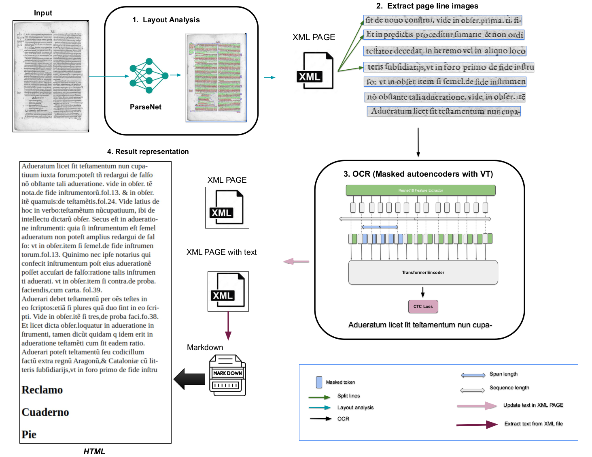

[[Project Page]](https://migueldelmolino.es/) 
[[Datasets]](https://zenodo.org/records/18901631)
[[Checkpoints]](https://zenodo.org/records/18901631/files/FP-THD-pretrained-model-MolinoDataset_batchZ64.tbz?download=1)

# 1. Introduction
Full page transcription of historical documents (FP-THD) is a pipeline for the transcription of historical documents preserving these special features. In this work, we propose to extend an existing text line recognition method with a layout analysis model. We analyze historical text images using a layout analysis model to extract text lines, which are then processed by an OCR model to generate a fully digitized page.

#  2. Overview architecture

<p align="center">

</p>

#  3. Repository organization

The repository is organized into four principal parts corresponding to the pipeline:

- **Layout analysis** (*Layout_analysis*): This is corresponding to analysis layout component.
- **Extraction of page line images** (*Extraction_of_page_line_images*): This component extracts individual line text images from the input to prepare them for subsequent processing.
- **OCR:**  The Masked Autoencoder with Vision Transformer (MAE-ViT) that is responsible to reconize the text.
- **Result representation:** (*Result_representation*) This component visualizes or displays the final output from the processing pipeline.

The other repository are **input** (to place the images of input), **train** to train and prepare the data for train from scratch the models and **args** to place the required arguments.

---


# 4. Pipeline Launch Guide

Follow the steps below to set up and run the pipeline.

---


### Step 1: Prepare Your Input Data

Go to the input/ directory and place your images there.

###  Step 2:  Layout analysis 

Clone the Repository layout analysis.

```bash
git clone https://github.com/DCGM/pero-ocr/tree/master
```

Copy the layout analysis using the following command:

```bash
cp -r  pero-ocr/pero_ocr/* ./Layout_analysis/
```

you should replace all the "pero_ocr" by "Layout_analysis". You can use this command :

```
grep -rl --include="*.py" "pero_ocr" | xargs sed -i 's/pero_ocr/Layout_analysis/g'
```

Make sure the folder "Layout_analysis"  is installed before proceeding and the General layout analysis (printed and handwritten) with european printed OCR specialized to czech newspapers can be downloaded here [download model](https://nextcloud.fit.vutbr.cz/s/NtAbHTNkZFpapdJ)
The model should be in ""args folder "" with the "config.ini" file.


###  Step 4 : OCR


The folder OCR contains ./model/ and ./utils/ from public repository  [HTR-VT](https://github.com/Intellindust-AI-Lab/HTR-VT/tree/main).


To execute the OCR step you should place the pretrained model in checkpoints folder. 

Go to this link and install the model : [FP-THD model](https://unizares.sharepoint.com/:f:/s/MigueldelMolino/EjPkMUjHV5ZCnGP5fCnTmr4BM-QkkvYUqeFRmvyXx_x0tA?e=EowShJ) .


###  Step 5: Run the Main Program

To run the piline execute the following command line: 

```bash
python main_pipeline.py --config-path ./args/config.ini  --image-folder ./input/ --cropped-lines-folder ./Extraction_of_page_line_images/  --save-dir ./args/checkpoints/ --out-dir Result_representation/ --exp-name text_xmls --image-extension tif

```


### Step 6 : View the Results

After execution, the output results will be available in the **Result_representation** folder.


---

# 4. Acknowledgement

This work was supported by the Aragon Regional Government (Spain) through the project [PROY_S11_24](https://www.migueldelmolino.es/). We acknowledge the help provided by public code repositories: [HTR-VT](https://github.com/Intellindust-AI-Lab/HTR-VT/tree/main) and [Pero-ocr](https://github.com/DCGM/pero-ocr/tree/master) .
